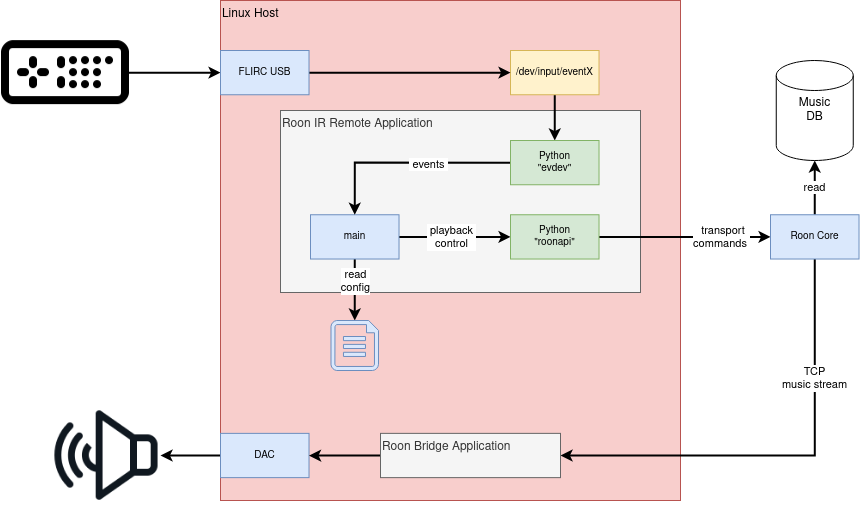

# The Project

The goals is to provide a bridge that converts received IR commands
 as keyboard events (provided by FLIRC USB device) into transport
 commands (e.g 'play', 'pause') that are send to the Roon API.



## Features

* support Roon transport commands

    - play, stop, play_pause, pause
    - skip, previous

* allows to initate the volume when amplifier
  with rest API exists

  	- currently only Yamaha API version 1 is supported

## Development Language

* development language will be Python
* documentation language will be English

## Software Requirements

- Python: __roon-api__, __evdev__

## Hardware Devices

- FLIRC USB device

## Configuration

- Roon zone name can be configured as Ansible host specific variable
- service name, user and group can be configured in host specific variables
- mapping between key codes and transport command can be configured
  in `config/app_info.json`

## Deployment

Before being able to deploy the software the following steps have
to be performed.

- change the hostname in `inventory.yml`
- add a new file that uses the same hostname as added above
- change the variables accordingly
- create a profile in `~/.ssh/config` that matches the hostname above
- copy your __public__ SSH key to the deployment target
- install the following requirements onto the target machine

    * python3, python3-pip, python3-apt
    * pip: setuptools
    * git

```shell script
cd deployment/
# check the setup

$ ansible-playbook -i inventory.yml site.yml -C
```